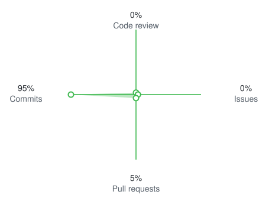



> ⚡ *Ship fast. Evaluate hard. Iterate harder.* ⚡

---

## 🧑‍💻 About Me

**Forward Deployed AI Engineer · London 🇬🇧**

- 🚀 I embed with teams, scope real problems, and ship AI solutions end-to-end
- 🧠 Building production multi-agent systems — LangGraph orchestration, RAG pipelines, Knowledge Graph retrieval
- 🔭 LLM observability with **LangFuse**, **LLM-as-a-Judge** evals, and **Guardrails AI** for safe deployments
- ☁️ Deploying on **AWS / Azure**, containerised with **Docker**, automated with **CI/CD** pipelines
- ⚙️ **FastAPI** backends + **TypeScript** frontends — full-stack ownership from prompt to prod
- 🤝 Love working directly with customers and engineers to turn messy requirements into working AI

---

## 🛠️ Tech Stack

**🤖 AI & Agents**

**⚙️ Backend & APIs**

**☁️ Cloud & DevOps**

**📊 Data & Observability**

---

## 🚀 Featured Projects

### ⭐ Flagship

<table>
<tr>
<td width="50%" valign="top">

#### 🧠 [Enterprise Knowledge Assistant](https://github.com/niti007/knowledge-graph-version-2)

*Hybrid vector + knowledge-graph RAG with a guarded LangGraph agent — measured, load-tested and live on Hugging Face.*

- 📈 Hybrid + re-rank lifts context precision **0.81 → 0.90**
- 🛡️ NeMo Guardrails, **0 of 46** emails leaked in PII tests
- 💸 **$0.0038** per answer · **473** tests

    

[**Repo**](https://github.com/niti007/knowledge-graph-version-2) · [**Live demo ↗**](https://nitishgalat-enterprise-knowledge-assistant.hf.space)

</td>
<td width="50%" valign="top">

#### ✉️ [Hyper-Targeted Cold Outreach Crew](https://github.com/niti007/hyper-targeted-cold-outreach-crew)

*Three CrewAI agents that research a real prospect, match their pain to an offering, and write a 3-sentence email grounded in live web evidence.*

- 🔎 Scout → Strategist → Copywriter, typed with **Pydantic** handoffs
- 🧾 Every claim backed by ≥2 cited quotes and URLs
- 🎛️ B2B and B2C modes · Streamlit UI + CLI · ~**$0.05–0.40** a run

    

[**Repo**](https://github.com/niti007/hyper-targeted-cold-outreach-crew)

</td>
</tr>
</table>

### 🤖 Agents & Retrieval

### 🔭 Evals, Observability & Safety

### 🎯 Apps

---

## 📊 GitHub Stats

---

*"Ship fast. Evaluate hard. Iterate harder."*

⭐ Star a repo if you find it useful!

